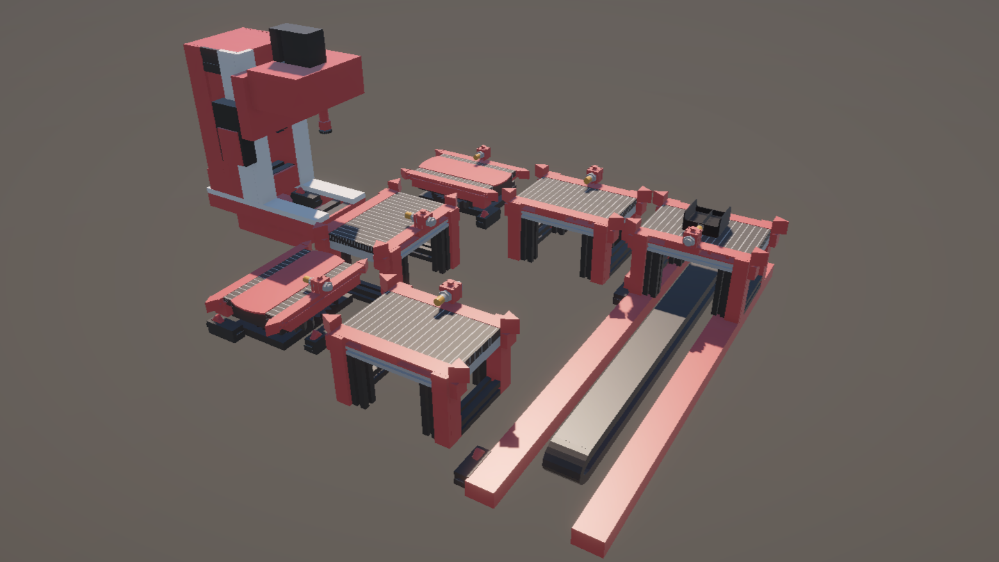
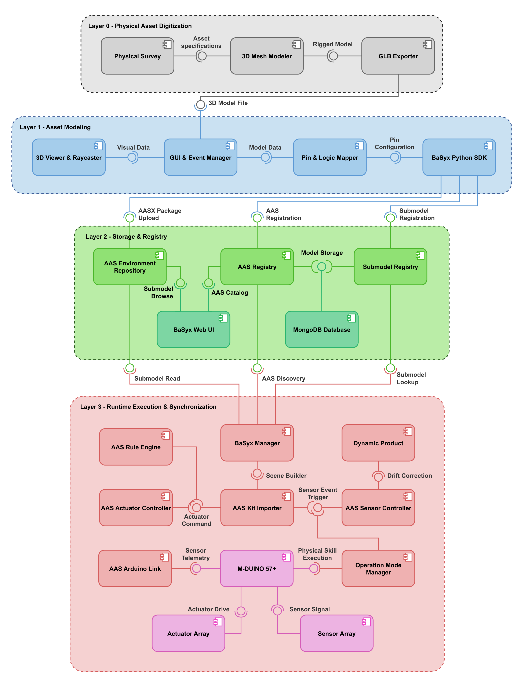
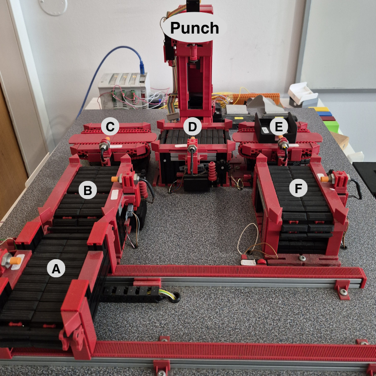

<div align="center"> 

# Automatic Generation of Simulation-Based Digital Twins from Asset Administration Shells
[](docs/thesis.pdf)


**Author:** [Tiago Daniel Santos Gouveia](https://pt.linkedin.com/)<sup>1</sup>  
*Advisor:* [Prof. Dr. André Dionisio Rocha](https://scholar.google.pt/citations?user=k1GIyqcAAAAJ&hl=pt-PT)<sup>1</sup> &nbsp;&nbsp;|&nbsp;&nbsp; *Co-Advisor:* [Nelson Nascimento de Freitas](https://scholar.google.com/)<sup>1</sup>

<sup>1</sup> **NOVA School of Science and Technology**,  
and Associated Lab of Intelligent Systems (LASI), NOVA University Lisbon, 2829-516 Caparica, Portugal

<table>
  <tr>
    <td style="vertical-align: top;">
      The Industry 4.0 paradigm relies on Cyber-Physical Systems (CPS) to achieve agile and resilient production. Digital Twins (DT) provide virtual representations capable of mirroring physical assets through real-time bidirectional telemetry. However, traditional development relies on proprietary simulation software, fragmented 3D CAD files lacking kinematics, and tedious manual matching of I/O addresses.<br/><br/>
      To overcome these barriers, this repository presents an open, modular, model-driven framework for automated procedural generation and live synchronization of industrial Digital Twins from Asset Administration Shells (AAS).
    </td>
    <td style="vertical-align: top;">
      
    </td>
  </tr>
</table>

</div>

---

## <div align="center">Implementation Architecture</div>

The architecture spans four decoupled tiers, bridging low-polygon geometric asset modeling to live physical shop-floor synchronization:

<p align="center">
  
</p>

1. **Layer 0 - Physical Asset Digitization (Blender):** Modeling lightweight 3D assets with proper origin points, metric scale, and kinematic hierarchy.
2. **Layer 1 - No-Code Semantic Authoring (AAS Client / Python):** Studio GUI (`conveyor_wizard.py`) for 3D raycasting asset placement, I/O pin mapping, visual control logic authoring, and packaging into standardized `.aasx` containers.
3. **Layer 2 - Containerized AAS Storage & Discovery (Docker & BaSyx v2):** Eclipse BaSyx microservices hosting Submodel Registries, AAS Servers, MQTT Broker (Mosquitto), and Time-Series DB (InfluxDB).
4. **Layer 3 - Procedural Simulation & Live Sync (Unity 3D Engine):** Procedural scene assembly from BaSyx AAS models, physics-based kinematic simulation, dual-mode execution (Virtual Commissioning / Live Telemetry Sync), and sensor drift correction.
5. **Physical Hardware & Firmware (M-DUINO PLC):** Industrial Shields PLC running FreeRTOS for low-latency 5 ms input scanning, optocoupled galvanic isolation, dual-channel TCP telemetry socket, and HTTP actuation.

---

## <div align="center">Repository Structure</div>

```
AAS-DT-Framework/
├── docs/                     # Master's Thesis document
│   └── thesis.pdf            # Full MSc Dissertation (NOVA FCT, 2026)
├── Layer 0 - 3D Models/      # Layer 0: Low-polygon 3D CAD assets (GLB) for authoring new AAS units
│   ├── Conveyor_Belt.glb     # Linear conveyor module
│   ├── Conveyor_Horizontal.glb # Translating conveyor diverter module
│   ├── Conveyor_Rotary.glb   # Rotating conveyor turntable module
│   ├── Punch_Station.glb     # Workpiece punch / machining station
│   └── Workpiece.glb         # Dynamic industrial workpiece / puck
├── Layer 1 - AAS Client/     # Layer 1: Python AAS Authoring Studio
│   ├── conveyor_wizard.py    # Main GUI Studio for AAS layout generation & submodel creation
│   ├── Backup_models/        # Complete pre-configured AAS backups for the modular FMS pilot testbed
│   └── requirements.txt      # Python dependencies for the authoring studio
├── Layer 2 - AAS Docker/     # Layer 2: Docker Compose infrastructure
│   ├── docker-compose.yml    # Eclipse BaSyx v2 (AAS Registry, Submodel Registry, AAS Server), Mosquitto MQTT & InfluxDB
│   ├── basyx/                # BaSyx configuration properties & YAMLs
│   ├── mosquitto/            # MQTT broker configuration
│   └── influxdb/             # InfluxDB database configuration
├── Layer 3 - DT Unity/       # Layer 3: Unity 3D Simulation & Telemetry Engine
│   ├── Assets/               # C# scripts, prefabs, materials, and AAS procedural generation logic
│   ├── Packages/             # Unity project dependency manifests
│   └── ProjectSettings/      # Unity project physics, tag, and layer settings
├── Hardware - FMS DT/        # Hardware Firmware
│   └── FMS_DT.ino            # FreeRTOS C++ code for Industrial Shields M-DUINO PLC control & TCP/HTTP telemetry
└── imgs/                     # Visual assets, architecture diagrams, and runtime screenshots
```

---

## <div align="center">Get Started</div>

Follow these steps to start the middleware services, author or deploy digital twin packages, and run the simulation:

1. **Start the AAS Middleware (Layer 2)**
   - Ensure Docker Desktop is running on your machine.
   - Start the containerized services located in the `Layer 2 - AAS Docker` directory.
   - This launches the Eclipse BaSyx v2 microservices (AAS Registry, Submodel Registry, and AAS Environment Server) alongside Mosquitto MQTT and InfluxDB for telemetry storage.

2. **Launch the Authoring Studio (Layer 1)**
   - Open the `Layer 1 - AAS Client` folder and install the Python dependencies listed in `requirements.txt`.
   - Run `conveyor_wizard.py` to author, configure, or deploy AAS packages to the BaSyx repository.

3. **Run the Simulation Engine (Layer 3)**
   - Open the `Layer 3 - DT Unity` project folder in **Unity 6 (6000.3.10f1)** or compatible version.
   - Open the main scene located at `Assets/Scenes/SampleScene.unity`.
   - Press **Play** in the editor to start the procedural simulation and connect to the running BaSyx server.

4. **Connect the Physical Hardware Controller (Optional)**
   - To link with the physical testbed, flash the firmware from `Hardware - FMS DT/FMS_DT.ino` onto the **Industrial Shields M-DUINO 57R+ PLC** using Arduino IDE or PlatformIO.
   - The controller will stream sensor transitions over low-latency TCP sockets (port 8888) and accept motor commands via HTTP REST (port 80) to synchronize with Unity in real time.

---

## <div align="center">Usage Instructions & Physical Testbed</div>

<p align="center">
  
</p>

Once the containers and simulation runtime are active, the platform supports two operational modes:

- **Virtual Commissioning (VC):** Operates entirely disconnected from physical hardware. Machine actuation, routing sequences, and sensor responses are driven by the local rule engine evaluating the `ControlLogic` submodel abstract syntax trees.
- **Live Telemetry Synchronization:** In operational mode, the Unity runtime establishes a dedicated TCP connection to the M-DUINO PLC (port 8888). Real-time optical and inductive sensor events update the virtual state.
- **Sensor Drift Correction:** When physical workpieces trigger physical track sensors, the simulation automatically snaps the nearest virtual workpiece to calibrated coordinates, eliminating accumulated PhysX numerical drift.


---

## <div align="center">Key Results & Performance</div>

Empirical evaluation on the physical modular FMS bench and 800 parametric stress-testing runs revealed:
- **Cold-boot instantiation** of the physical pilot bench in under **2.8s**.
- **Steady-state rendering rates** exceeding **480 FPS** for small to medium layouts.
- **Scalability:** Near-linear scaling up to 250 modules and stable real-time execution up to 500 modules (>90 FPS).

---

## <div align="center">Citation</div>

> ℹ️ **Publication Note:** This Master's dissertation is currently undergoing academic defense and review at NOVA School of Science and Technology (NOVA FCT). The official publication link, permanent handle, and BibTeX citation from **RUN (Repositório da Universidade NOVA)** will be made available here upon public release.
